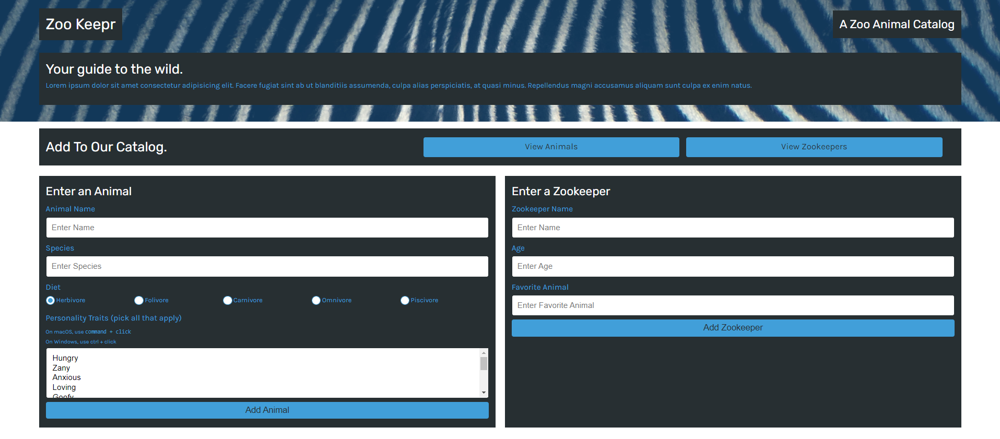

# Zookeepr

## Description
A Heroku-hosted JavaScript platform that enables professional zoos to maintain a clean database of animals and zookeeper staff as well as add new animals and staff members quickly and easily!

## **Table of Contents**
* [Screenshot](#screenshot)
* [Website](#website)
* [Usage](#usage)
* [License](#license)
* [Questions](#questions)

## **Screenshot**

## **Website**
[Zookeepr](https://zookeepr-lawn-version.herokuapp.com/)

## **Usage**
1. To view the current inventory of animals, click the `View Animals` button
2. To view the current staff, click the `View Zookeepers` button
3. Use the `Enter an Animal` form to add to the animal inventory
4. Use the `Enter a Zookeeper` form to add the information of a new staff member

## **Questions**
Please contact me directly with any additional questions:
* [GitHub](https://github.com/ChristopherLawn)
* [Email](mailto:christopher.lawn@yahoo.com)